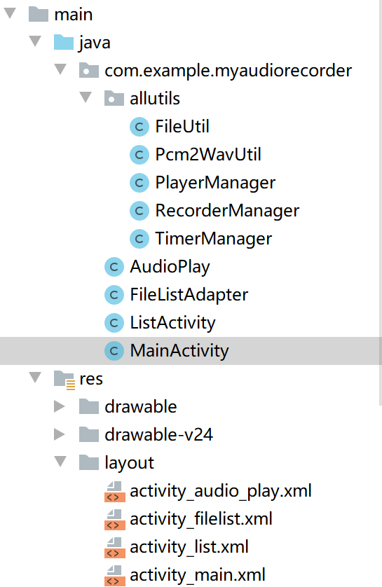
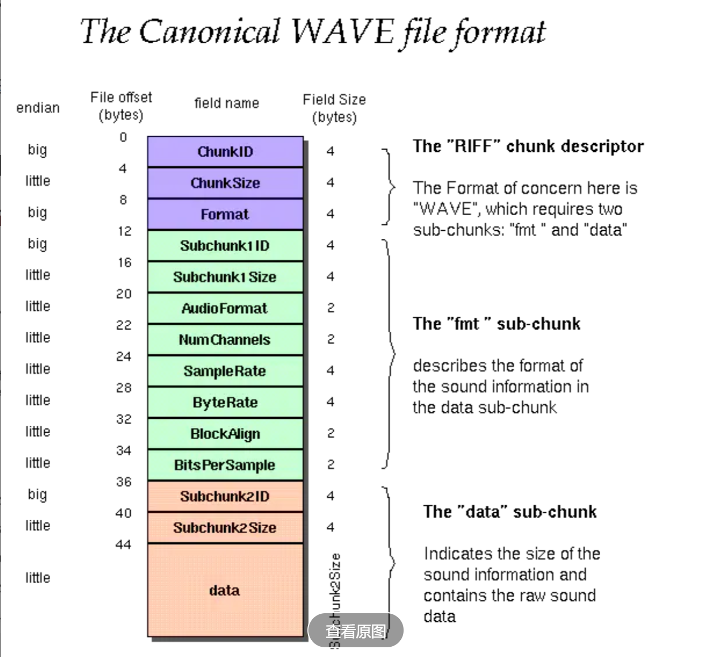

# android录音APP

## 一、功能简介与操作视频

**该APP功能完成音频的录制并命名保存与播放功能**

**1、录制**

在音频录制界面点击`开始`按钮即可进行录制，录制过程中可以点击`暂停`按钮暂时停止录制，暂停可以继续录制，点击`停止`按钮结束录制，然后，跳出`命名和保存`框，点击`删除`按钮则不保存此次录音文件，在输入框输入文件名并点击`保存`按钮可以保存此次录音的音频文件

**2、查看录音文件列表**

在音频录制界面中点击`文件列表`按钮即可跳转查看录音文件列表，该列表显示了`ARecordFiles`文件夹中所有的录音文件，长按某个录音文件可以选择删除它，点击某个录音文件，跳转到播放该录音文件界面

**3、播放**

进入播放界面后，点击`播放`按钮即可进行播放，播放过程中可以点击`暂停`按钮暂时停止播放，暂停可以继续播放，点击`结束`按钮结束播放。一次播放结束后，可以再次点击`播放`按钮重新播放

<iframe height=500 width=500 src="./operate.gif">

## 二、文件夹结构

`version1`文件夹中APP只支持音频文件的录制功能

`version2`文件夹中APP支持音频录制、暂停继续录制和查看文件列表功能

`finalversion`文件夹中APP支持音频录制、暂停继续录制、查看文件列表、删除文件列表中某个文件以及播放文件列表中某个音频文件的功能



`FileUtil.java`找出`ARecordFiles`文件下所有音频文件然后保存到`ArrayList`中

`Pcm2WavUtil.java`将原始的`.pcm`音频文件转成可直接播放的`.wav`音频文件

`PlayerManager.java`与音频播放有关

`RecorderManager.java`与音频录制有关

`TimerManager.java`与计时器有关

`AudioPlay.java`实现具体的音频播放功能，与`activity_audio_play.xml`绑定

`FileListAdapter.java`继承了`BaseAdapter`适配器，目的是将文件显示在`listview`控件中，与`activity_filelist`绑定

`ListActivity.java`实现具体的文件显示功能，主要用到了`listview`控件，与`activity_list`绑定

`MainActivity.java`实现具体的音频录制功能，与`activity_filelist`绑定

`ListActivity.java`实现具体的文件显示功能，主要用到了`listview`控件，与`activity_main`绑定

## 三、实现

### 3.1 录制

使用java自带的AudioRecord进行录制

实现录音步骤：

①计算缓冲录音数据的字节数组的大小。AudioRecord 需要一个容器来缓冲来自硬件的音频信息。

`bufferSize=AudioRecord.getMinBufferSize(AUDIO_SAMPLE_RATE,AUDIO_CHANNEL,AUDIO_ENCODING);`

②创建AudioRecord对象

`myrecord=new AudioRecord(AUDIO_INPUT,AUDIO_SAMPLE_RATE,AUDIO_CHANNEL,AUDIO_ENCODING,bufferSize);`

③初始化一个buffer

`buffer = new byte[bufferSize];`

④开始录音

```java
myrecord.startRecording();
Recordstatus=Status.STATUS_START;
```

⑤创建一个数据流，一边从AudioRecord中读取声音数据到初始化的buffer，一边将buffer中数据导入数据流，这里创建一个**新线程**完成该操作，注意使用`Environment.getExternalStorageDirectory()`获取手机存储的根目录

```java
new Thread(()->{

            FileOutputStream os=null;

            try {

                //首先创建文件夹
                File dirFile = new File(Environment.getExternalStorageDirectory(),DirName);
                if(!dirFile.exists()){
                    dirFile.mkdirs();
                }
                File myfile=new File(dirFile,finalFileName);

                //如果文件存在，先删除文件
                if(myfile.exists()){
                    myfile.delete();
                }

                //然后创建新文件
                myfile.createNewFile();

                os = new FileOutputStream(myfile);
            }
            catch (FileNotFoundException e) {
                e.printStackTrace();
            }
            catch (Exception e) {
                Log.e("TestFile", "Error on write File:" + e);
            }

            if(os!=null){
                //判断录音的状态
                while(Recordstatus==Status.STATUS_START){
                    int read = myrecord.read(buffer, 0, bufferSize);

                    // 如果读取音频数据没有出现错误，就将数据写入到文件
                    if (AudioRecord.ERROR_INVALID_OPERATION != read) {
                        try {
                            os.write(buffer);
                            os.flush();
                        } catch (IOException e) {
                            e.printStackTrace();
                        }
                    }

                }
                try {
                    os.flush();
                    os.close();
                } catch (IOException e) {
                    e.printStackTrace();
                }
            }
        }

        ).start();
```

⑥停止录音

```java
		myrecord.stop();
        Recordstatus=Status.STATUS_STOP;

        myrecord.release();
        myrecord=null;
        

        Recordstatus=Status.STATUS_NO_READY;
```

**另外，还可以使用MediaPlayer进行录制。**MediaPlayer比AudioRecord更上层，使用起来更方便、易用，但是AudioRecord偏底层，因此也就更灵活，我可以自由设置`位宽`，`采样率`，`通道数`与`录制时所使用的的麦克风`这些参数。

**录制声音MediaRecorder和AudioRecord 区别**

> <1>.MediaRecorder和AudioRecord都可以录制音频，区别是MediaRecorder录制的音频文件是经过压缩后的，需要设置编码器。并且录制的音频文件可以用系统自带的Music播放器播放。 
>
> <2>.而AudioRecord录制的是PCM格式的音频文件，需要用AudioTrack来播放，AudioTrack更接近底层。 
>
> 在用MediaRecorder进行录制音视频时，最终还是会创建AudioRecord用来与AudioFlinger进行交互。 
>
> <3>.MediaRecorder录制的数据是 amr MP3 格式 ，AudioRecord录制出来的是比较原始的PCM音频格式 ，PCM经过编码压缩可以为 amr MP3 AAC。

### 3.2 暂停/继续录制

**实现该功能最重要的是对录音状态的控制**

```java
构建状态类，控制录音状态
public enum Status {
        //未开始
        STATUS_NO_READY,
        //预备
        STATUS_READY,
        //录音
        STATUS_START,
        //暂停
        STATUS_PAUSE,
        //停止
        STATUS_STOP
    }
    //初始状态为未开始
private Status Recordstatus=Status.STATUS_NO_READY;
```

每次**录音开始---录音暂停/停止**这一阶段我们称之为一个**周期**，而每个周期都**创建一个临时`.pcm`文件**，保存该周期录制的音频，因此**暂停/继续录制**功能的实现可看成是**将录制分成多个周期**，最终得到多个临时小文件，最后将这些小文件合并成为一个大的`.pcm`文件完成对该功能的实现。**这里注意：**每个周期的临时文件命名不能冲突，否则会出现覆盖，导致某部分音频的缺失，另外要将各个周期的临时文件名**按照创建顺序保存下来**，保证最后音频的顺序性。

```java
//合并所有临时文件成为一个文件
    public void mergeAllFiles(){

        File finalFile =new File(Environment.getExternalStorageDirectory(),DirName+"/"+Afilename);
        FileOutputStream os=null;

        try {
            //创建最终文件
            finalFile.createNewFile();
            os = new FileOutputStream(finalFile);

            //将每个临时文件的内容读出来并保存到最终文件中，同时删除临时文件
            for (String fileName : AllFiles) {
                FileInputStream in =null;
                File infile=new File(Environment.getExternalStorageDirectory(),DirName+"/"+fileName);
                in = new FileInputStream(infile);
                byte[] data = new byte[bufferSize];
                while (in.read(data) != -1) {
                    os.write(data);
                }
                in.close();
                infile.delete();//删除临时文件
            }

            AllFiles.clear();//清除ArrayList
            FileVersion=1;//清除版本号
            os.close();

        }catch (FileNotFoundException e) {
            e.printStackTrace();
        }
        catch (Exception e) {
            Log.e("TestFile", "Error on write File:" + e);
        }

    }
```

### 3.3 pcm转wav

> **pcm与wav:**
>
> 一般通过麦克风采集的录音数据都是PCM格式的，即不包含头部信息，播放器无法知道音频采样率、位宽等参数，导致无法播放，在pcm文件的数据开头加入WAVE HEAD数据即可转成wav文件

**wav头文件：**



| 偏移地址 | 命名          | 内容                                                         |
| -------- | ------------- | ------------------------------------------------------------ |
| 00-03    | ChunkId       | "RIFF"                                                       |
| 4-07     | ChunkSize     | 下个地址开始到文件尾的总字节数(此Chunk的数据大小)            |
| 08-11    | fccType       | "WAVE"                                                       |
| 12-15    | SubChunkId1   | "fmt ",最后一位空格                                          |
| 16-19    | SubChunkSize1 | 一般为16，表示fmt  Chunk的数据块大小为16字节，即20-35        |
| 20-21    | FormatTag     | 1：表示是PCM 编码                                            |
| 22-23    | Channels      | 声道数，单声道为1，双声道为2                                 |
| 24-27    | SamplesPerSec | 采样率                                                       |
| 28-31    | BytesPerSec   | 码率 ：采样率 * 采样位宽 * 声道个数，bytePerSecond = sampleRate * (bitsPerSample / 8) * channels |
| 32-33    | BlockAlign    | 每次采样的大小：位宽*声道数/8                                |
| 34-35    | BitsPerSample | 位宽                                                         |
| 36-39    | SubChunkId2   | "data"                                                       |
| 40-43    | SubChunkSize2 | 音频数据的长度                                               |
| 44-...   | data          | 音频数据                                                     |

**Pcm2WavUtil.java**

```java
//pcm转wav工具
public class Pcm2WavUtil {
    private int sampleRateInHz;//采样率
    private int channelConfig;//声道数
    private int audioFormat;//采样位数
    private int mBufferSize;//最小缓冲区大小

    //构造函数
    public Pcm2WavUtil(int sampleRate,int channel,int format,int size){
        sampleRateInHz=sampleRate;
        channelConfig=(channel == AudioFormat.CHANNEL_IN_MONO )? 1 : 2;//声道数
        audioFormat=(format==AudioFormat.ENCODING_PCM_16BIT) ? 16 : 8;//采样位数
        mBufferSize=size;
    }

    //pcm转wav函数
    public  void pcmToWav(String inFilename, String outFilename) {
        FileInputStream in;
        FileOutputStream out;
        long totalAudioLen;
        long totalDataLen;

        long byteRate =  sampleRateInHz *audioFormat *channelConfig  ;//码率
        byte[] data = new byte[mBufferSize];
        try {
            //首先创建文件夹
            File inFile = new File(Environment.getExternalStorageDirectory(),inFilename);
            File outFile =new File(Environment.getExternalStorageDirectory(),outFilename);
            //如果文件存在，先删除文件
            if(outFile.exists()){
                outFile.delete();
            }

            //然后创建新文件
            outFile.createNewFile();

            in = new FileInputStream(inFile);
            out = new FileOutputStream(outFile);
            totalAudioLen = in.getChannel().size();
            totalDataLen = totalAudioLen + 36;

            writeWaveFileHeader(out, totalAudioLen, totalDataLen,
                    byteRate);
            while (in.read(data) != -1) {
                out.write(data);
            }
            in.close();
            out.close();
        } catch (FileNotFoundException e) {
            e.printStackTrace();
        }
        catch (IOException e) {
            e.printStackTrace();
        }
    }


    /**
     * 加入wav文件头
     */
    private void writeWaveFileHeader(FileOutputStream out, long totalAudioLen,
                                            long totalDataLen, long byteRate)
            throws IOException {
        byte[] header = new byte[44];
        // RIFF/WAVE header
        header[0] = 'R';
        header[1] = 'I';
        header[2] = 'F';
        header[3] = 'F';
        header[4] = (byte) (totalDataLen & 0xff);
        header[5] = (byte) ((totalDataLen >> 8) & 0xff);
        header[6] = (byte) ((totalDataLen >> 16) & 0xff);
        header[7] = (byte) ((totalDataLen >> 24) & 0xff);
        //WAVE
        header[8] = 'W';
        header[9] = 'A';
        header[10] = 'V';
        header[11] = 'E';
        // 'fmt ' chunk
        header[12] = 'f';
        header[13] = 'm';
        header[14] = 't';
        header[15] = ' ';
        // 4 bytes: size of 'fmt ' chunk
        header[16] = 16;
        header[17] = 0;
        header[18] = 0;
        header[19] = 0;
        // format = 1
        header[20] = 1;
        header[21] = 0;
        header[22] = (byte) channelConfig;
        header[23] = 0;
        header[24] = (byte) (sampleRateInHz & 0xff);
        header[25] = (byte) ((sampleRateInHz >> 8) & 0xff);
        header[26] = (byte) ((sampleRateInHz >> 16) & 0xff);
        header[27] = (byte) ((sampleRateInHz >> 24) & 0xff);
        header[28] = (byte) (byteRate & 0xff);
        header[29] = (byte) ((byteRate >> 8) & 0xff);
        header[30] = (byte) ((byteRate >> 16) & 0xff);
        header[31] = (byte) ((byteRate >> 24) & 0xff);
        // block align
        header[32] = (byte) (channelConfig *audioFormat  / 8);
        header[33] = 0;
        // bits per sample
        header[34] = (byte)audioFormat;
        header[35] = 0;
        //data
        header[36] = 'd';
        header[37] = 'a';
        header[38] = 't';
        header[39] = 'a';
        header[40] = (byte) (totalAudioLen & 0xff);
        header[41] = (byte) ((totalAudioLen >> 8) & 0xff);
        header[42] = (byte) ((totalAudioLen >> 16) & 0xff);
        header[43] = (byte) ((totalAudioLen >> 24) & 0xff);
        out.write(header, 0, 44);
    }

}
```

### 3.4 自定义文件名保存

当我们完成音频文件保存时，我们希望自定义要保存的同时，同时系统能够检测输入的文件名是否存在

这里我们使用**带EditText的AlertDialog**，**但是**在使用AlertDialog时，无论点击“确定”(PositiveButton)还是“取消”(NegativeButton)，对话框都会消失，但是在输入文件名为空或者该文件存在，对话框不应该消失，而是应该保留该对话框并提示用户

**解决方法：**

> **在创建AlertDialog时setPositiveButton方法的OnClickListener参数需传入null，然后让dialog show出来以后，再通过getButton(AlertDialog.BUTTON_POSITIVE)方法重新得到确定按钮，重设点击事件，这时如果不手动去调dialog.dismiss()，对话框就不会消失了**

```java
		final EditText init = new EditText(this);//带EditText的AlertDialog
        AlertDialog myalert = new AlertDialog.Builder(this).setTitle("命名和保存")
                .setIcon(R.mipmap.ic_launcher)
                .setView(init)
                .setPositiveButton("保存", null)
                .setNegativeButton("删除",new DialogInterface.OnClickListener() {
                    @Override
                    public void onClick(DialogInterface dialog, int which) {
                        audiorecord.deleteFile();//点击删除后将最后的临时文件删除
                    }
                }).create();
        myalert.show();
        myalert.getButton(AlertDialog.BUTTON_POSITIVE).setOnClickListener(new View.OnClickListener() {
                @Override
                public void onClick(View v) {
                    String input = init.getText().toString();

                    if (input.equals("")) {
                      
                        Toast.makeText(getApplicationContext(), "文件名不能为空！", Toast.LENGTH_SHORT).show();
                        return;
                    }
                    else if(audiorecord.isFile(input)) {//判断文件是否存在
                       
                        Toast.makeText(getApplicationContext(), "该文件已存在!", Toast.LENGTH_SHORT).show();
                        return;
                    }
                    else{
         
                        //转换，必须写在dialog内部！
                        audiorecord.PcmTOWav(input+".wav");

                        Toast.makeText(getApplicationContext(), "文件保存成功!", Toast.LENGTH_SHORT).show();
                        //让AlertDialog消失
                        myalert.dismiss();

                        audiorecord.deleteFile();//将最后的临时文件删除
                        
                        //跳转到文件列表
                        Intent it=new Intent(MainActivity.this,ListActivity.class);
                        startActivity(it);
                    }
                }

        });
```

### 3.5 文件列表显示

主要使用`listview`空间显示所有文件

```xml
<ListView
        android:layout_width="match_parent"
        android:layout_height="655dp"
        android:id="@+id/listView"></ListView>
```

> 一个ListView的创建需要3个元素:
>
> （1）ListView中的每一列的View。
>
> （2）填入View的数据或者图片等。
>
> （3）连接数据与ListView的适配器。

**也就是说，要使用ListView，首先要了解什么是适配器。**适配器是一个连接数据和AdapterView（ListView就是一个典型的AdapterView）的桥梁，通过它能有效地实现数据与AdapterView的分离设置，使AdapterView与数据的绑定更加简便，修改更加方便。**因此`FileListAdapter.java`实现了该适配器，使用了BaseAdapter自定义适配器实现ListView**

```java
listView = (ListView) findViewById(R.id.listView);
list = FileUtil.getWavFiles();
adapter = new FileListAdapter(this, list);
listView.setAdapter(adapter);
```

#### (1)功能1：长按某个Item选择删除该Item对应的文件

**这里设置长按监听器，进行删除**

```java
listView.setOnItemLongClickListener(new AdapterView.OnItemLongClickListener() {
            @Override
            public boolean onItemLongClick(AdapterView<?> parent, View view, int position, long id) {
                File file= list.get(position);
                String filename=file.getName();
                Toast.makeText(getApplicationContext(),"you choose the file : "+filename,Toast.LENGTH_SHORT).show();
                //弹框确定是否删除
                myDialog(filename);//使用了alertdialog

                return true;
                //关于返回值，若返回False，则是当长按时，既调用onItemLongClick，同时调用onItemLongClick后
                //还会调用onItemClick，就是说会同时调用onItemLongClick，和onItemClick，
                //若返回true，则只调用onItemLongClick
            }
        });
```

#### (2)功能2：单击某个Item跳转到播放界面

**设置单击监听器即可**

```java
listView.setOnItemClickListener(new AdapterView.OnItemClickListener() {
            @Override
            public void onItemClick(AdapterView<?> parent, View view, int position, long id) {               
                File file= list.get(position);
                String filename=file.getName();
                Intent playView=new Intent(ListActivity.this,AudioPlay.class);
                playView.putExtra("file",filename);
                startActivity(playView);
            }
        });
```

### 3.6 播放

**使用[MediaPlayer](https://www.runoob.com/w3cnote/android-tutorial-mediaplayer.html)播放音频**，主要使用如下几个函数

```java
setDataSource(String filename):设置要播放的文件名
prepare()：准备(同步)
release()：释放MediaPlayer对象
start()：开始播放
stop()：停止播放
pause()：暂停
reset()：重置MediaPlayer对象
setOnCompletionListener(MediaPlayer.OnCompletionListener listener)： 网络流媒体播放结束监听
```

还可以使用`AudioTracker`播放音频，但是`AudioTracker`只能播放`.pcm`文件（使用`AudioTracker`相当于使用`AudioRecord`的逆过程），所以对于`.wav`文件需要跳过前44字节的数据。

为了简便使用，这里我们选择了`MediaPlayer`，但是因为本程序中，在**播放自动结束**后，我们还需要控制时钟并且设置播放状态和按钮，因此使用`MediaPlayer`不如`AudioRecord`灵活方便，在这里，我们使用布局**重新跳转回当前播放界面**来实现（目前我只会这样，如果你有更好的方法，可以联系我），如下图

```java
		//监听MediaPlayer播放完成
        mediaPlayer.setOnCompletionListener(new MediaPlayer.OnCompletionListener() {
            @Override
            public void onCompletion(MediaPlayer mp) {
                //当自动播放完成后，需要重新设置状态，并且暂停计时器，目前我只会这样写：
                //关闭当前页面，跳转到新的播放页面
                stop();
                Intent it=new Intent(mcontext, AudioPlay.class);
                it.putExtra("file",filename);
                it.setFlags(Intent.FLAG_ACTIVITY_CLEAR_TOP);//方法1：关闭当前页面
                mcontext.startActivity(it);


            }
        });
```

**播放声音时MediaPlayer和AudioTrack的区别**

> 播放声音可以用MediaPlayer和AudioTrack，两者都提供了java API供应用开发者使用。虽然都可以播放声音，但两者还是有很大的区别的。 
>
> <1>.其中最大的区别是MediaPlayer可以播放多种格式的声音文件，例如 MP3，AAC，WAV，OGG，MIDI等。MediaPlayer会在framework层创建对应的音频解码器。 
>
> <2>.而AudioTrack只能播放已经解码的PCM流，如果是文件的话只支持wav格式的音频文件，因为wav格式的音频文件大部分都是PCM流。AudioTrack不创建解码器，所以只 能播放不需要解码的wav文件。
>
> <3>当然两者之间还是有紧密的联系，MediaPlayer在framework层还是会创建AudioTrack，把解码后的PCM数流传递给AudioTrack，AudioTrack再传递给AudioFlinger进行混音，然后才传递给硬件播放。

### 3.7 计时器

主要使用[`Chronometer`](https://blog.csdn.net/dsaaf21/article/details/112846792)控件，使用起来操作还是很简单的

```xml
		<Chronometer
                 android:layout_width="match_parent"
                 android:layout_height="200dp"
                 android:format="00:00:00"
                 android:gravity="center"
                 android:textSize="70dp"
                 android:id="@+id/timer"/>
```

### 3.8 跳转到下一个界面前删除当前界面

有时当我们从当前界面跳转到下一个界面时，我们不希望按返回键又返回到当前界面

**方法一（使用setflags）：**

```java
Intent it = new Intent();
it.setClass(ListActivity.this, ListActivity.class);
it.setFlags(Intent.FLAG_ACTIVITY_CLEAR_TOP);//方法1：关闭当前页面
startActivity(it);
```

**方法二（使用finish）：**

```java
Intent it = new Intent();
it.setClass(ListActivity.this, ListActivity.class);
startActivity(it);
finish();
```


